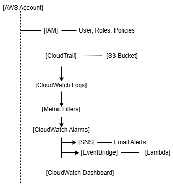
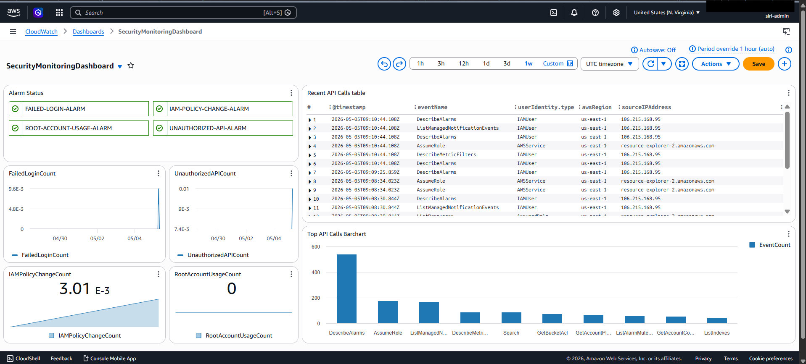
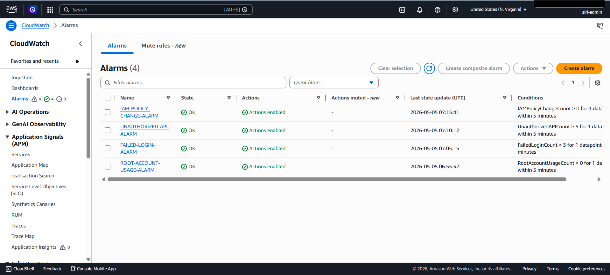
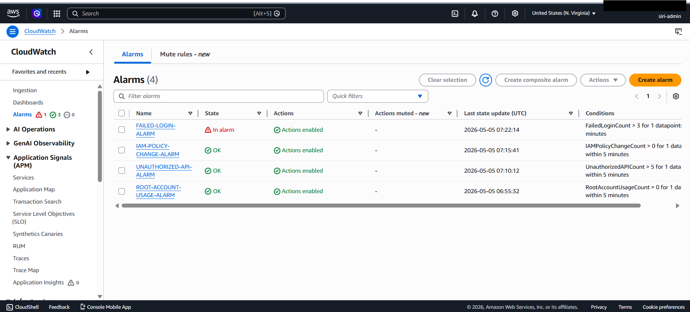
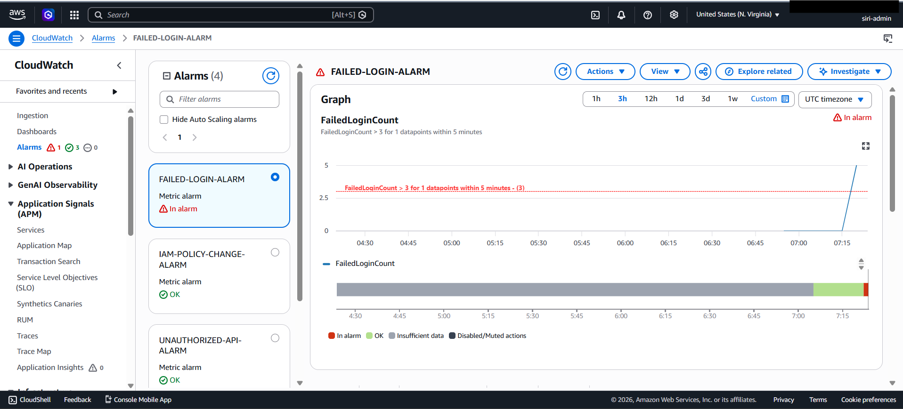
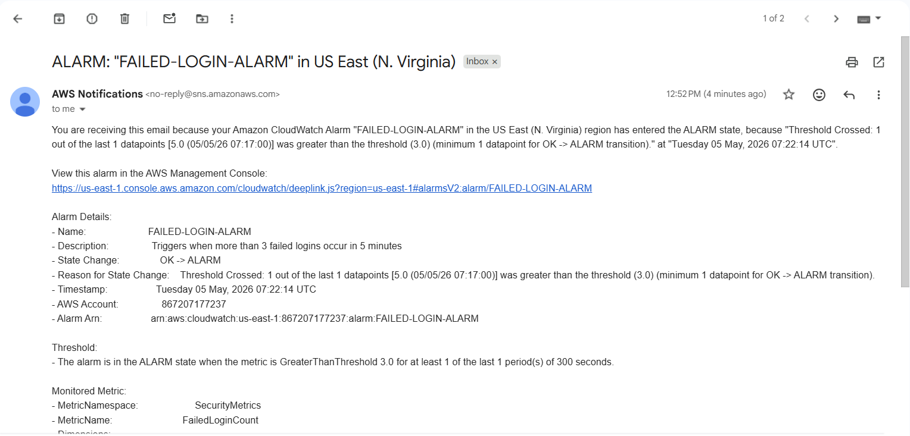
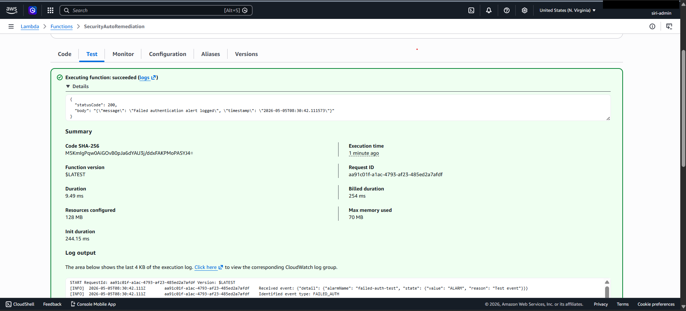
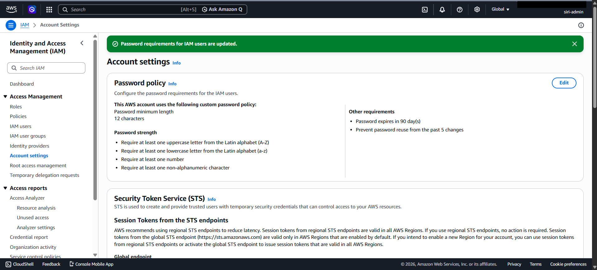
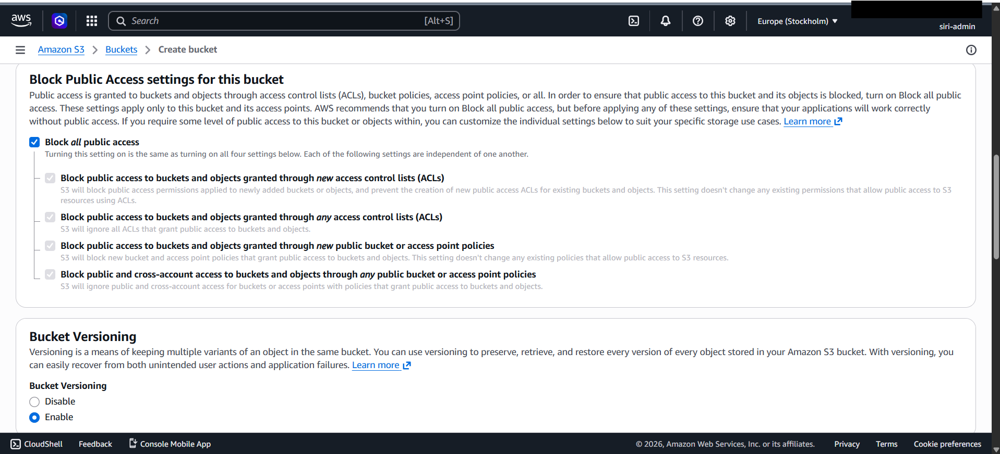

# AWS Cloud Security Monitoring Dashboard

## Project Overview
A cloud security monitoring system built on AWS that detects threats, 
enforces compliance, and automates remediation across cloud infrastructure.

## Architecture
[Architecture diagram - coming soon]

## Technologies Used
- AWS CloudTrail — Audit logging
- AWS S3 — Secure log storage
- AWS Security Hub — Compliance monitoring
- AWS CloudWatch — Real time monitoring and alerting
- AWS Lambda — Automated remediation
- AWS IAM — Identity and access management
- Python — Lambda function development

## Project Phases

### Phase 1 — IAM Foundation ✅
- Secured root account with MFA
- Created least privilege IAM roles
- Implemented custom security auditor policy
- Configured account password policy meeting CIS standards

### Phase 2 — Audit Logging ✅
- Deployed S3 bucket with versioning and encryption
- Configured CloudTrail for all region monitoring
- Enabled log file validation for tamper detection
- Integrated CloudTrail with CloudWatch Logs for real time analysis

### Phase 3 — Compliance Monitoring 🔄
- Security Hub with CIS AWS Foundations Benchmark
- AWS Foundational Security Best Practices
- NIST 800-53 compliance checks

### Phase 4 — Automated Threat Detection 🔄
- Custom CloudWatch metric filters on CloudTrail logs
- Alerts for root account usage
- Alerts for failed authentication attempts
- Alerts for unauthorized API calls
- Alerts for IAM policy changes

### Phase 5 — Lambda Remediation 🔄
- Automated IAM key deactivation on suspicious activity
- EventBridge integration for real time response
- Python based remediation functions

### Phase 6 — Security Dashboard 🔄
- CloudWatch dashboard showing security metrics
- Real time visibility into security posture

## IAM Security Policy
Custom least privilege policy created for security auditor role:
- Read only access to CloudTrail, GuardDuty, Security Hub
- IAM credential report generation
- No write or delete permissions

## Key Security Decisions
| Decision | Reason |
|---|---|
| Enabled MFA on all accounts | Prevent unauthorized access even if password compromised |
| All region CloudTrail | Prevent attackers hiding activity in unused regions |
| S3 versioning enabled | Recover logs if attacker attempts to delete them |
| Log file validation | Detect if logs were tampered with post breach |
| Least privilege IAM roles | Limit blast radius if credentials are compromised |
| Excluded KMS events from CloudTrail | Reduce log noise, focus on security relevant activity |

## Compliance Frameworks Covered
- CIS AWS Foundations Benchmark
- NIST Special Publication 800-53
- AWS Foundational Security Best Practices

## Screenshots
## Architecture Diagram

## Project Screenshots

### Security Dashboard

### CloudWatch Alarms

### Failed Login Detection (Tested)

###Failed Login Alarm Email (Tested)

### Lambda Function Test

### IAM Security Setup

### S3 Secure Log Storage

## Future Improvements
- Enable CloudTrail Insights for ML based anomaly detection
- Add VPC Flow Logs for network traffic monitoring
- Implement CloudTrail Network Activity Events for VPC endpoint monitoring
- Enable SSE-KMS encryption on CloudTrail logs
- Add S3 Object Lock for WORM compliance
